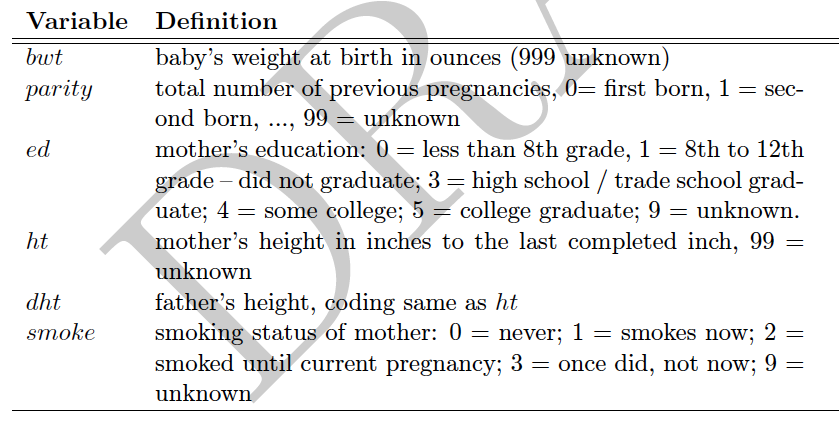
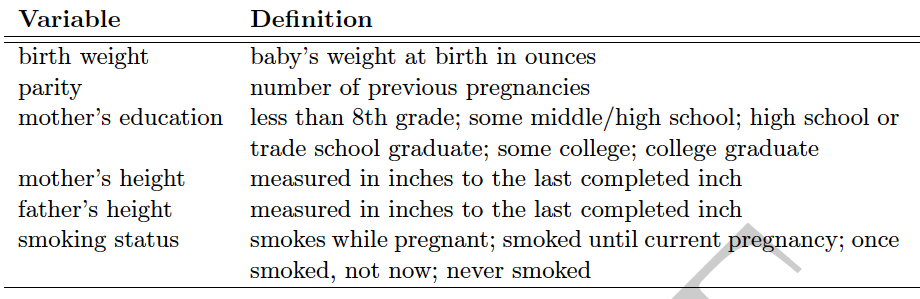
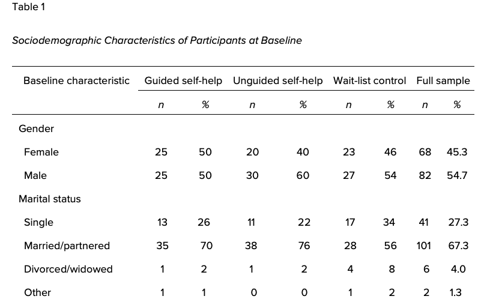

  
## Structure of a Statistical Report

Based on the Junker report, we will consider the basic outline of a statistical report.

1. Introduction
2. Body (including data, methods, analysis, and results)
3. Conclusion(s)/Discussion
4. Appendix/Appendices

## Introduction

The introduction should provide the following.

1. A summary of the study and data, as well as any relevant background (literature review) and framing (what sets your study apart from others in the literature)
2. The "big questions" answered by your analyses, and summaries of your conclusions about those questions.
3. A brief outline/guide to the rest of the paper.

## Body

1. Detailed data and study description
2. Methods
3. Analysis
4. Results

## Detailed data and study description

See Nolan and Stoudt chapter 3 (on Sakai) for some great suggestions here.

1. Design: how did the data arise?  From a designed experiment, observational study, web scraping?
2. Protocol: study setting (e.g., location and time period), description of the participants (including any eligibility criteria), how participants were selected (e.g., via a probability model or non-random mechanism)
3. Outcome measures, definition, and units of measurement
4. Definitions of predictor variables (including units)
5. Description of nonresponse, including any missing values, dropouts, or loss to follow-up
6. Population to which the results should be generalized (or not)

## Variable tables

Here's an example of a codebook excerpt (from Nolan & Stoudt).

{width=6in}

This is very helpful for a programmer, who needs to map numeric codes to their meanings. Someone who is reading your paper does not need to know (or care) that 3=once did, not now or that 99=unknown.

## Tables

Here is a corresponding publication-quality table (Nolan & Stoudt).

Often, instead of the table above, you will see a "table 1," providing simple descriptive statistics of variables, that will appear at the beginning of the results section.

## 

For the previous example, your table would also include % missing or unknown for each variable.

## Methods

Data cleaning is an important part of the processing pipeline and should be clearly documented. Be sure to address aspects such as any observations excluded from analysis (and why), quantification & treatment of missing values, transformations and derivations of variables, aggregation of observations to a higher level of granularity (e.g., averaging exposures over a full day), and merges of multiple data sets.

For example, in the second case study, some observations are collected at 700 Hz, while others are collected at 4 Hz. You'll need to describe how the scales were aligned for analysis.

## More Methods

In general, you want the methods section of the manuscript to describe an analytic process that is *computationally reproducible*. So any data processing or modeling steps should be clear. The model should be very clearly described using mathematical notation (pay attention to indices!). You should be able to read this section and then code the analysis, potentially with help from the appendix for things like variable definitions (that is, the paper itself doesn't need to tell you that 3=once did, not now, only that it was a category you included as a predictor or outcome in a model).

## Analysis and Results

Often these sections are combined. Here you describe the results of your modeling, any validation/sensitivity analysis, and your main findings. Generally multiple helpful tables and figures are included in this section.

## Conclusions/Discussion

Come back to the questions raised in the introduction, perhaps including additional details from the analysis question. Raise new questions, future work, and areas for further investigation here.

## Appendix

This can include material not central to understanding your manuscript, such as

- technical descriptions (e.g., steps in posterior sampling)
- detailed tables or output
- extra figures
- reproducible code

