  
## Statistical Analysis Plan

A *statistical analysis plan (SAP)* describes planned analyses for a study.  This plan serves numerous purposes.

- NIH *requires* submission of a SAP for any funded clinical trial.  According to the NIH director, Dr. Francis COllins, the goal is go discourage "P-value hacking, where people sort of shop around for a statistical test to give them the p-value that they love."
- Many journals (including NEJM and JAMA) request the SAP for publication of clinical trials 
- SAP's for observational studies enhance reproducibility and transparency
- "Contract" between study PI's and data scientists facilitating clarity in communication and increased efficiency

## SAP Timing

The SAP is generally completed along with the study protocol, often at the time of a grant application but certainly before data analysis begins.

The rationale for this timing is that this prevents "p-hacking" or "data-dredging" in which hypotheses are modified based on "significance" of findings.  Such exploratory analyses have their place but should be clearly denoted as such in any reporting.

## SAP's and the Individual Project

The [Duke Clinical & Translational Science Institute (CTSI) SAP](https://sakai.duke.edu/access/content/group/e5248fc7-f1dd-4cdb-a810-1432395057b6/Report%20Writing%20and%20Revision/Writing%20a%20Statistical%20Report/SAP%20template%202019-05-28.docx) is a nice example of the type of SAP used in major medical centers. Completing this SAP is a great way to help you formalize your hypotheses and analysis plan as we move towards the methods submission of your project (October 12).

I'll use as an example the Popes/leaders data from case study 1. You can download the SAP and follow along -- we'll take breaks so that you can fill in your own information.

We'll go back and forth a bit between sections of the report -- the first half is administrative (yet still important), and the second half provides the meat of the analysis plan.

## Admin. Info. & Investigator Agreement

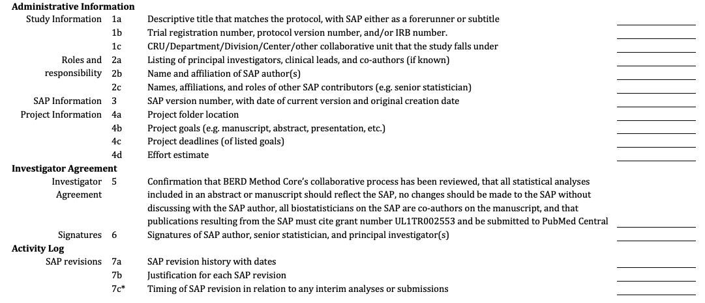

Key components of these sections: ethical assurances, authorship information, timeframe

## Study Overview

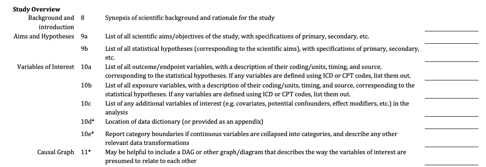

Let's hone in on the relevant items in the second section.

## 1. Study Overview

Background/Introduction: *This section should be written by the author of the SAP so other biostatisticians can easily follow and to ensure everyone understands the background and goals of the project. If pieces are copied from the protocol or other documents, cite the document. References are not necessary here.*

1.1 Study Aims

1.2.1 Primary Hypotheses (1-2 primary; rest are secondary)

1.2.2 Secondary Hypotheses

## 1. Study Overview

<small>Background/Introduction: Stander et al. explored post-election lifetimes of Roman Catholic popes in a paper designed to facilitate teaching of survival analysis techniques. We plan to consider a slightly enlarged group of leaders in an attempt to hone in on potential changes in lifespan over the years as well as across leadership types. </small>

Aim 1: How are year of birth and type of leadership related to a leader's lifespan?

Aim 2: Does any relationship between year of birth and lifespan depend on the type of leadership?

Aim 3: Determine the probability that certain living world leaders will outlive each other.

The primary hypothesis is that modern leaders typically enjoy longer lifespans than historical leaders.

The secondary hypothesis is that the relationship between year of birth and lifespan may vary depending on leadership type, which is an imperfect proxy for sociopolitical conditions that may be changing over time.

## Complete this section for your project!

##

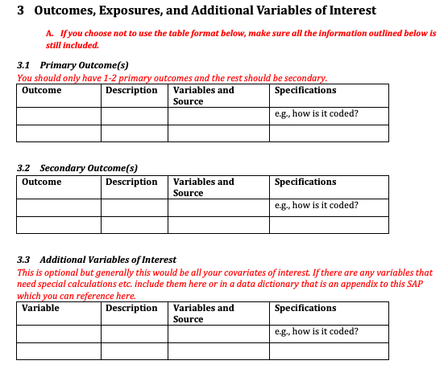

## Primary Outcome (3.1)

|Outcome           |Description                     |Variable Name and Source     | Specifications |
| ----------    | ---------------------------         | --------------- | --------- |
| Lifespan    | Total known lifespan (years)        |   Age.Event (leaders.RData)  |  Years (continuous) |
| Censoring indicator | Indicates whether date of death is known | Censored (leaders.RData)  | 1=Censored (still alive or date of death not known), 0 otherwise | 

## Additional Variables of Interest (3.3)

|Variable           |Description                     |Variable Name and Source     | Specifications |
| ----------    | ---------------------------         | --------------- | --------- |
| Name | Name of Leader | Name (leaders.RData) | Character | 
| Birth Date | Date of Birth | Birth.Date (leaders.RData) | YYYY-MM-DD |
| Leadership Type | Leader of What?| Type (leaders.RData) | 5-level factor (Pope, Emperor of China, Emperor of Japan, Dalai Lama, US President) |
| Date Assumed Office | Date Assumed Role | Year.Elected (popes_25_December_2016.csv); to be determined for other leaders | Integer year; to be determined for non-popes |

## Fill in outcomes and variables for your project!

## Study Plan and Design, Sample Size, and Interim Analyses (if planned)

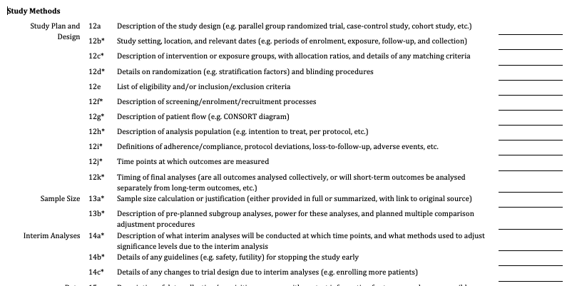

## Data

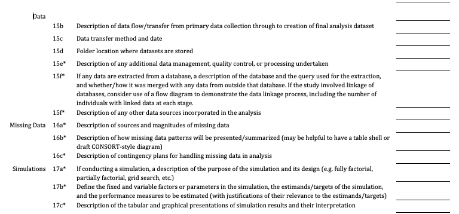

## Study Population

2.1	Inclusion Criteria

2.2	Exclusion Criteria

2.3	Data Acquisition
- Study design	

- Data source/how the data were collected	

- Contact information for team member responsible for data collection/acquisition	

- Date or version (if downloaded, provide date)	

- Data transfer method and date	

- Where dataset is stored	

- Notes: Include any additional details that give information about how this data set was acquired.

## Study Population: Leaders

<small> Inclusion Criteria: Included leaders were elected Pope, born Dalai Lama, served as Emperor of China or Japan, or were elected US President and born/served roughly during the time span 1300-2020

Exclusion Criteria: The Xuantong Emperor was the last Emperor of China, abdicating in 1912, and Chinese leaders after that time (including his brief returns) are not included in the data 

Study Design: This is an observational study of religious and political leaders. Leaders were chosen based on duration of ruling line (to cover as much of the time period as possible), accessibility and reliability of data, and data entry time budget

Data source/how the data were collected: Data from Popes were obtained from Stander et al. Data on emperors, presidents, and Dalai Lamas were obtained from Wikipedia.

Contact information for team member responsible for data collection/acquisition: Amy Herring, amy.herring@duke.edu

Date or version: August 15, 2020 </small>

## Complete Section 2: Study Population for Your Project

Note: Section 16 from the first half of the document, Missing Data, is very important. You'll want to be conscious of it as you draft your analysis plan.

## Analysis Plan

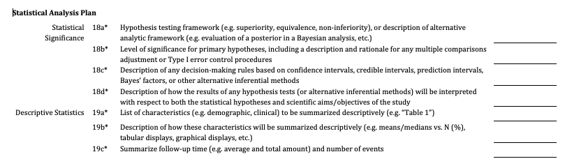

## Analysis Methods

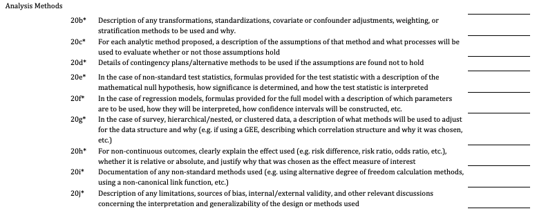

## Additional Analysis Methods

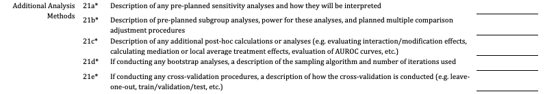

## Exploratory Analyses

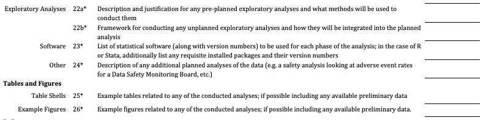

## References and Appendices

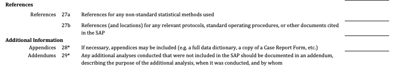

## Section 4: Statistical Analysis Plan

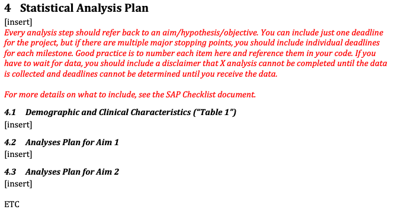

## SAP for Popes

**4.1 Demographic and Clinical Characteristics (Table 1)**

Table 1 will provide descriptive statistics of the predictors by leadership type, including the n(%) of each type of leader; the minimum, quartiles, and maximum of date of birth by leadership type, and the minimum, quartiles, and maximum of date of assumption of leadership role (if this can be determined) by leadership type.

<small> Note: Date assuming the leadership role is easily determined for US presidents and Popes. The situation is more complex for emperors and Dalai Lamas. Dalai Lamas are reincarnations of their predecessors, but it may take years for them to be identified. Emperors are tricky -- they often are born "in line" to rule, but also may come into power through political or military machinations. This will make comparisons tricky due to survivor bias, which will be addressed later. </small>

##  Analysis Plan for Aim 2 (A Start)

Aim 2: Does any relationship between year of birth and lifespan depend on the type of leadership?

<small>Aim 2 will be addressed in the framework of a Weibull accelerated failure time model, which allows us to accommodate the censoring in the data as well as the potentially increasing hazard of death as individuals age. This model will be fit in R software using the code provided in Stander et al. In order to determine whether any relationship between year of birth and lifespan depends on type of leadership, we will need an interaction term between each of the 4 leadership type indicators (Japanese emperors will be our referent group) and our year of birth parameterization (modeled using a cubic spline as described in Aim 1). In order to evaluate the hypotheses, we will examine the posterior distribution of estimate corresponding to percentage increases in survival, with 95% HPD intervals not containing the null value considered evidence of an association. Potentially non-linear effects of age and/or year of birth will be summarized graphically across the leadership types.</small>

##  Analysis Plan for Aim 2 (Continued)

<small>Transformed residuals will be used to evaluate model fit, along with external validation using data on prime ministers of New Zealand and Presidents of Argentina. 

When comparing leadership types with differing protocols in age of assuming office, survivorship bias presents challenges. For example, most Popes are elected as senior citizens, while Dalai Lamas are  born such and identified after birth. Thus comparisons of lifespans of these individuals is a challenge, as Popes would not have been elected had they died in young adulthood. For this reason, Stander et al. evaluated remaining lifespan beyond the age at election. We will conduct a sensitivity analysis in our data for leaders for whom age at election is available (most of those in the dataset) by fitting a model with the revised outcome of lifespan after election, with predictors including a parameterization of year of birth (as described above), age at election (again we will explore using splines or polynomial forms), leadership type, and interactions of the two time variables with leadership type.  A second sensitivity analysis will focus exclusively on comparing popes and presidents born after 1700, and a third will focus exclusively on Chinese and Japanese emperors through the end of the nineteenth century. </small>

##  Analysis Plan for Aim 2 (Continued)

Time (and budget) permitting, we will address issues of generalizability of the data via exploratory analysis incorporating available data on other types of leaders, including other heads of state or major religious or social figures. Challenges in using data on social/societal leaders, such as Wangari Maathai, Malala Yousafzai, or Greta Thunberg, will be defining the time point at which they assumed a leadership role. 

## Work on Your SAP!

