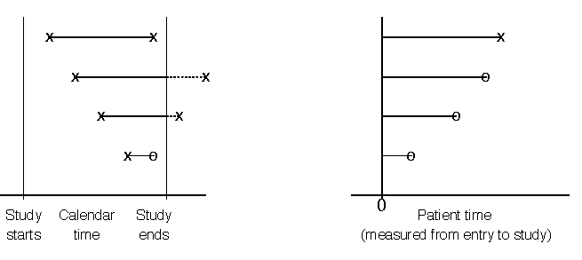

## Survival Data

In many studies, the outcome of interest is the time from an initial observation until the occurrence of some event of interest, e.g.

- Time from transplant surgery until new organ failure

- Time to death in a pancreatic cancer trial

- Time to first sex

- Time to menopause

- Time to divorce

- Time to receipt of bachelor's degree

Typically, the event of interest is called a *failure* (even if it is a good thing).   The time interval between a starting point and the failure is known as the *survival time* and is often represented by $t$.

## Survival Data

Certain aspects of survival data make data analysis particularly challenging. 

- Typically, not all the individuals are observed until their times of failure
    - An organ transplant recipient may die in an automobile accident before the new organ fails
    - A student may withdraw from the program to start a multi-billion dollar health company
    - Not everyone gets divorced
    - A pancreatic cancer patient may move to Aitutaki instead of undergoing further treatment
- In this case, an observation is said to be *censored* at the last point of contact with the patient.

## Survival


I hope you do visit Aitutaki some day! The Cook Islands are really nice.

## Study Time and Patient Time

{width=4in}


It is important to distinguish between study time and patient time.

- A study may start enrolling patients in September and continue until all 500 patients have been enrolled
- This is likely to take months or years
- Time is typically converted to patient time (time between enrollment and failure or censoring) before analysis
- In the world leaders data, patient time is the time from birth to death; study time can be represented by year of birth and year of death

## Survival Function

The distribution of survival times is characterized by the *survival function*, represented by $S(t)$.  For a continuous random variable $T$, $S(t)=Pr(T>t),$ and $S(t)$ represents the proportion of individuals who have not yet failed.  


The graph of $S(t)$ versus $t$ is called a survival curve.  The survival curve shows the proportion of survivors at any given time.

Note: sometimes the survival function is defined as $S(t)=Pr(T \geq t)$.

## Vaccination in Burkina Faso, 2004 *BMJ*


## Estimating Survival Curves

Consider a small study with 10 patients.

|Patient           |Event Time                     |Event Type     |
| --------   | ---------------------------         | --------------- |
| 1    | 4.5 | Death |
| 2    | 7.5 | Death |
| 3    | 8.5 | Censored|
| 4    | 11.5 | Death |
| 5    | 13.5 | Censored |
| 6    | 15.5 | Death |
| 7    | 16.5 | Death |
| 8    | 17.5 | Censored |
| 9    | 19.5 | Death |
| 10    | 21.5 | Censored |

How do we estimate the survival curve for these data?

## Kaplan-Meier Estimate

Perhaps the most popular estimate of a survival curve is the *Kaplan-Meier* or *product-limit* estimate.  This method is actually fairly intuitive.

- $I_t$:  # at risk of failure at time $t$ (i.e., those who did not fail before $t$ and those who were not censored before $t$)
- $d_t$:  # who fail at time $t$
- $q_t=\frac{d_t}{I_t}$:  estimated probability of failing at time $t$
- $S(t)$:  cumulative probability of surviving beyond time $t$, estimated as 
$\hat{S}(t)=\prod_{t_i \leq t} \left(1-\frac{d_{t_i}}{I_{t_i}}\right)$

## How is this Intuitive?

$\hat{S}(t)=\prod_{t_i \leq t} \left(1-\frac{d_{t_i}}{I_{t_i}}\right)$

At each time $t$, the probability of surviving is just $1-Pr(failing)$.  Before there are any failures in the data, our estimated $\hat{S}(t)=1$.  At the time of the first failure, this probability falls below 1 and is simply one minus the probability of failing at that time, or $1-\frac{\# ~ failures}{\#~at ~ risk~ of~ failing}$.


After the first failure, things get more complicated.  At the time of the second failure, you can calcuate $1-\frac{\# ~ failures}{\# ~ at ~risk ~  of ~ failing}$, but this doesn't provide the whole picture, as someone else has already died.  In fact, this is the conditional probability of surviving now that you've made it past the time of the first failure.  

## How is this Intuitive?

$\hat{S}(t)=\prod_{t_i \leq t} \left(1-\frac{d_{t_i}}{I_{t_i}}\right)$

How do you then calculate the total (unconditional) probability of survival?  That is just the product of the probability of surviving past the first failure times the conditional probability of surviving beyond the second failure given that you made it past the first, or ...

## 

$Pr(\text{survive past first and second times})$
$=Pr(\text{survive past 1st time}) \times$ $Pr(\text{survive past 2nd time}\mid\text{survived past 1st time})$
$=\left(1-\frac{\# ~ failures ~at ~failure~ time~ 1}{\# ~at~ risk ~of ~failing ~at ~failure ~time ~1}\right)\left(1-\frac{\# ~of ~ failures ~ at ~ failure ~ time~  2}{\# ~ at ~ risk ~ of ~ failing ~ at ~ failure~  time~ 2}\right)$


If someone is censored, they are no longer at risk of failing at the next failure time and are taken out of the calculation

## Kaplan-Meier (KM) Estimate
$\hat{S}(t)=\prod_{t_i \leq t} \left(1-\frac{d_{t_i}}{I_{t_i}}\right)$

|$t$ | # Failed ($d_t$) | # Censored | # Left ($I_{t+1}$) | $\hat{S}(t)$ |
| --------   | -----------  | ------- | --------- | ------------- |
| 0.0 | 0 | 0 | | |
| 4.5 | 1 | 0 | | | 
| 7.5 | 1 | 0 | | |
| 8.5 | 0 | 1 | | |
| 11.5 | 1 | 0 | | |
| 13.5 | 0 | 1 | | |
| 15.5 | 1 | 0 | | |
| 16.5 | 1 | 0 | | |
| 17.5 | 0 | 1 | | |
| 19.5 | 1 | 0 | | |
| 21.5 | 0 | 1 | | |

## Kaplan-Meier (KM) Estimate
$\hat{S}(t)=\prod_{t_i \leq t} \left(1-\frac{d_{t_i}}{I_{t_i}}\right)$

|$t$ | # Failed ($d_t$) | # Censored | # Left ($I_{t+1}$) | $\hat{S}(t)$ |
| --------   | -----------  | ------- | --------- | ------------- |
| 0.0 | 0 | 0 | 10 | 1 |
| 4.5 | 1 | 0 | | | 
| 7.5 | 1 | 0 | | |
| 8.5 | 0 | 1 | | |
| 11.5 | 1 | 0 | | |
| 13.5 | 0 | 1 | | |
| 15.5 | 1 | 0 | | |
| 16.5 | 1 | 0 | | |
| 17.5 | 0 | 1 | | |
| 19.5 | 1 | 0 | | |
| 21.5 | 0 | 1 | | |


## Kaplan-Meier (KM) Estimate
$\hat{S}(t)=\prod_{t_i \leq t} \left(1-\frac{d_{t_i}}{I_{t_i}}\right)$

|$t$ | # Failed ($d_t$) | # Censored | # Left ($I_{t+1}$) | $\hat{S}(t)$ |
| --------   | -----------  | ------- | --------- | ------------- |
| 0.0 | 0 | 0 | 10 | 1 |
| 4.5 | 1 | 0 | 9 | 1-$\frac{1}{10}$=0.9 | 
| 7.5 | 1 | 0 | | |
| 8.5 | 0 | 1 | | |
| 11.5 | 1 | 0 | | |
| 13.5 | 0 | 1 | | |
| 15.5 | 1 | 0 | | |
| 16.5 | 1 | 0 | | |
| 17.5 | 0 | 1 | | |
| 19.5 | 1 | 0 | | |
| 21.5 | 0 | 1 | | |

## Kaplan-Meier (KM) Estimate
$\hat{S}(t)=\prod_{t_i \leq t} \left(1-\frac{d_{t_i}}{I_{t_i}}\right)$

|$t$ | # Failed ($d_t$) | # Censored | # Left ($I_{t+1}$) | $\hat{S}(t)$ |
| --------   | -----------  | ------- | --------- | ------------- |
| 0.0 | 0 | 0 | 10 | 1 |
| 4.5 | 1 | 0 | 9 | 0.9 | 
| 7.5 | 1 | 0 | 8 | 0.9$\times (1-\frac{1}{9})$=0.8 |
| 8.5 | 0 | 1 | | |
| 11.5 | 1 | 0 | | |
| 13.5 | 0 | 1 | | |
| 15.5 | 1 | 0 | | |
| 16.5 | 1 | 0 | | |
| 17.5 | 0 | 1 | | |
| 19.5 | 1 | 0 | | |
| 21.5 | 0 | 1 | | |

## Kaplan-Meier (KM) Estimate
$\hat{S}(t)=\prod_{t_i \leq t} \left(1-\frac{d_{t_i}}{I_{t_i}}\right)$

|$t$ | # Failed ($d_t$) | # Censored | # Left ($I_{t+1}$) | $\hat{S}(t)$ |
| --------   | -----------  | ------- | --------- | ------------- |
| 0.0 | 0 | 0 | 10 | 1 |
| 4.5 | 1 | 0 | 9 | 0.9 | 
| 7.5 | 1 | 0 | 8 | 0.8 |
| 8.5 | 0 | 1 | 7 | 0.8$\times (1-\frac{0}{8})$=0.8 |
| 11.5 | 1 | 0 | | |
| 13.5 | 0 | 1 | | |
| 15.5 | 1 | 0 | | |
| 16.5 | 1 | 0 | | |
| 17.5 | 0 | 1 | | |
| 19.5 | 1 | 0 | | |
| 21.5 | 0 | 1 | | |


## Kaplan-Meier (KM) Estimate
$\hat{S}(t)=\prod_{t_i \leq t} \left(1-\frac{d_{t_i}}{I_{t_i}}\right)$

|$t$ | # Failed ($d_t$) | # Censored | # Left ($I_{t+1}$) | $\hat{S}(t)$ |
| --------   | -----------  | ------- | --------- | ------------- |
| 0.0 | 0 | 0 | 10 | 1 |
| 4.5 | 1 | 0 | 9 | 0.9 | 
| 7.5 | 1 | 0 | 8 | 0.8 |
| 8.5 | 0 | 1 | 7 | 0.8 |
| 11.5 | 1 | 0 | 6 | 0.8$\times (1-\frac{1}{7})$=0.69 |
| 13.5 | 0 | 1 | | |
| 15.5 | 1 | 0 | | |
| 16.5 | 1 | 0 | | |
| 17.5 | 0 | 1 | | |
| 19.5 | 1 | 0 | | |
| 21.5 | 0 | 1 | | |

## Kaplan-Meier (KM) Estimate
$\hat{S}(t)=\prod_{t_i \leq t} \left(1-\frac{d_{t_i}}{I_{t_i}}\right)$

|$t$ | # Failed ($d_t$) | # Censored | # Left ($I_{t+1}$) | $\hat{S}(t)$ |
| --------   | -----------  | ------- | --------- | ------------- |
| 0.0 | 0 | 0 | 10 | 1 |
| 4.5 | 1 | 0 | 9 | 0.9 | 
| 7.5 | 1 | 0 | 8 | 0.8 |
| 8.5 | 0 | 1 | 7 | 0.8 |
| 11.5 | 1 | 0 | 6 | 0.69 |
| 13.5 | 0 | 1 | 5 | 0.69 |
| 15.5 | 1 | 0 | | |
| 16.5 | 1 | 0 | | |
| 17.5 | 0 | 1 | | |
| 19.5 | 1 | 0 | | |
| 21.5 | 0 | 1 | | |

## Kaplan-Meier (KM) Estimate
$\hat{S}(t)=\prod_{t_i \leq t} \left(1-\frac{d_{t_i}}{I_{t_i}}\right)$

|$t$ | # Failed ($d_t$) | # Censored | # Left ($I_{t+1}$) | $\hat{S}(t)$ |
| --------   | -----------  | ------- | --------- | ------------- |
| 0.0 | 0 | 0 | 10 | 1 |
| 4.5 | 1 | 0 | 9 | 0.9 | 
| 7.5 | 1 | 0 | 8 | 0.8 |
| 8.5 | 0 | 1 | 7 | 0.8 |
| 11.5 | 1 | 0 | 6 | 0.69 |
| 13.5 | 0 | 1 | 5 | 0.69 |
| 15.5 | 1 | 0 | 4 | 0.69$\times (1-\frac{1}{5})$= 0.552|
| 16.5 | 1 | 0 | | |
| 17.5 | 0 | 1 | | |
| 19.5 | 1 | 0 | | |
| 21.5 | 0 | 1 | | |

## Kaplan-Meier (KM) Estimate
$\hat{S}(t)=\prod_{t_i \leq t} \left(1-\frac{d_{t_i}}{I_{t_i}}\right)$

|$t$ | # Failed ($d_t$) | # Censored | # Left ($I_{t+1}$) | $\hat{S}(t)$ |
| --------   | -----------  | ------- | --------- | ------------- |
| 0.0 | 0 | 0 | 10 | 1 |
| 4.5 | 1 | 0 | 9 | 0.9 | 
| 7.5 | 1 | 0 | 8 | 0.8 |
| 8.5 | 0 | 1 | 7 | 0.8 |
| 11.5 | 1 | 0 | 6 | 0.69 |
| 13.5 | 0 | 1 | 5 | 0.69 |
| 15.5 | 1 | 0 | 4 | 0.552|
| 16.5 | 1 | 0 | 3 | 0.552$\times (1-\frac{1}{4})$= 0.414 |
| 17.5 | 0 | 1 | | |
| 19.5 | 1 | 0 | | |
| 21.5 | 0 | 1 | | |

## Kaplan-Meier (KM) Estimate
$\hat{S}(t)=\prod_{t_i \leq t} \left(1-\frac{d_{t_i}}{I_{t_i}}\right)$

|$t$ | # Failed ($d_t$) | # Censored | # Left ($I_{t+1}$) | $\hat{S}(t)$ |
| --------   | -----------  | ------- | --------- | ------------- |
| 0.0 | 0 | 0 | 10 | 1 |
| 4.5 | 1 | 0 | 9 | 0.9 | 
| 7.5 | 1 | 0 | 8 | 0.8 |
| 8.5 | 0 | 1 | 7 | 0.8 |
| 11.5 | 1 | 0 | 6 | 0.69 |
| 13.5 | 0 | 1 | 5 | 0.69 |
| 15.5 | 1 | 0 | 4 | 0.552|
| 16.5 | 1 | 0 | 3 | 0.414 |
| 17.5 | 0 | 1 | 2 | 0.414 |
| 19.5 | 1 | 0 | | |
| 21.5 | 0 | 1 | | |

## Kaplan-Meier (KM) Estimate
$\hat{S}(t)=\prod_{t_i \leq t} \left(1-\frac{d_{t_i}}{I_{t_i}}\right)$

|$t$ | # Failed ($d_t$) | # Censored | # Left ($I_{t+1}$) | $\hat{S}(t)$ |
| --------   | -----------  | ------- | --------- | ------------- |
| 0.0 | 0 | 0 | 10 | 1 |
| 4.5 | 1 | 0 | 9 | 0.9 | 
| 7.5 | 1 | 0 | 8 | 0.8 |
| 8.5 | 0 | 1 | 7 | 0.8 |
| 11.5 | 1 | 0 | 6 | 0.69 |
| 13.5 | 0 | 1 | 5 | 0.69 |
| 15.5 | 1 | 0 | 4 | 0.552|
| 16.5 | 1 | 0 | 3 | 0.414 |
| 17.5 | 0 | 1 | 2 | 0.414 |
| 19.5 | 1 | 0 | 1 | 0.414$\times (1-\frac{1}{2})$=0.207 |
| 21.5 | 0 | 1 | | |


## Kaplan-Meier (KM) Estimate
$\hat{S}(t)=\prod_{t_i \leq t} \left(1-\frac{d_{t_i}}{I_{t_i}}\right)$

|$t$ | # Failed ($d_t$) | # Censored | # Left ($I_{t+1}$) | $\hat{S}(t)$ |
| --------   | -----------  | ------- | --------- | ------------- |
| 0.0 | 0 | 0 | 10 | 1 |
| 4.5 | 1 | 0 | 9 | 0.9 | 
| 7.5 | 1 | 0 | 8 | 0.8 |
| 8.5 | 0 | 1 | 7 | 0.8 |
| 11.5 | 1 | 0 | 6 | 0.69 |
| 13.5 | 0 | 1 | 5 | 0.69 |
| 15.5 | 1 | 0 | 4 | 0.552|
| 16.5 | 1 | 0 | 3 | 0.414 |
| 17.5 | 0 | 1 | 2 | 0.414 |
| 19.5 | 1 | 0 | 1 | 0.207 |
| 21.5 | 0 | 1 | 0  | 0.207 |

What would $\hat{S}(21.5)$ be if the last observation were a failure instead of censored?

## Kaplan-Meier Estimate

In between failure times, the KM estimate does not change but is constant.  This gives the estimated survival function its step-like appearance (we call this type of function a *step function*). If we have a very large data set, the KM estimate may look smooth if the steps are very small.


## General Formulation


The primary object of inferential interest is generally the survival function, $S(t)=Pr(T>t)$. 

The cumulative distribution function F is defined as the complement of the survival function: $F(t)=Pr(T \leq t)$. Then if F is differentiable, its derivative is the density function $f(t)$.  

The *hazard function*, often represented using  $\lambda(t)$, is the event rate at time $t$ conditional on survival to time $t$ (or later). It is defined as $\lambda(t)=\underset{dt \rightarrow 0}{\text{lim}} \frac{Pr(t \leq T < t+dt)}{dt \cdot S(t)}=\frac{f(t)}{S(t)}$.  

## Parametric Survival Models: Exponential and Weibull

The shape and characteristics of the hazard and survival functions depend on the assumed probability distribution for the survival times.

Recall the exponential distribution, $f(t)=\lambda e^{-\lambda t}$, for $\lambda, t>0$, which has mean $\frac{1}{\lambda}$ and variance $\frac{1}{\lambda^2}$. The exponential survivor function $S(t)=Pr(T>t)=\int_t^\infty \lambda e^{-\lambda t} dt=\frac{-\lambda e^{-\lambda t}}{\lambda}|_t^\infty=e^{-\lambda t}$, and so the exponential hazard $h(t)$ (to avoid confusing notation here) is given by $h(t)=\frac{f(t)}{S(t)}=\lambda \frac{e^{-\lambda t}}{e^{-\lambda t}}=\lambda$.   The parameter $\lambda$ is often called a scale parameter.

## Exponential Distribution

So under the exponential model, the hazard of the event of interest does not change with time.  Let's generate some data and look at the exponential pdf.

```{r exp, echo=FALSE, out.width='70%'}
# thanks to dkmathstats
library(ggplot2)
x_lower=0; x_upper=10; 
max_height2 <- max(dexp(x_lower:x_upper, rate = 1, log = FALSE), 
                    dexp(x_lower:x_upper, rate = 0.1, log = FALSE),
                    dexp(x_lower:x_upper, rate = 0.01, log = FALSE))
ggplot(data.frame(x = c(x_lower, x_upper)), aes(x = x)) + xlim(x_lower, x_upper) + 
     ylim(0, max_height2) +
     stat_function(fun = dexp, args = list(rate = 1), aes(colour = "1")) + 
     stat_function(fun = dexp, args = list(rate = 0.1), aes(colour = "0.1")) + 
     stat_function(fun = dexp, args = list(rate = 0.01), aes(colour = "0.01")) + 
     scale_color_manual("lambda", values = c("blue", "green", "red")) +
     labs(x = "\n x", y = "f(x) \n", 
        title = "Exponential Distribution Density Plots \n") + 
     theme(plot.title = element_text(hjust = 0.5), 
         axis.title.x = element_text(face="bold", colour="blue", size = 12),
         axis.title.y = element_text(face="bold", colour="blue", size = 12),
         legend.title = element_text(face="bold", size = 10),
         legend.position = "right")

```

## Exponential Hazard

Here's the exponential hazard for the same values of $\lambda$.

```{r exphaz, echo=FALSE,out.width='70%'}
ggplot(data.frame(x = c(x_lower, x_upper)), aes(x = x)) + xlim(x_lower, x_upper) + 
     ylim(0, max_height2) +
     geom_hline(aes(yintercept=1, linetype="1"),colour="red") +
     geom_hline(aes(yintercept=0.1,linetype="0.1"),colour="green") +
     geom_hline(aes(yintercept=0.01,linetype="0.01"),colour="blue") +
     labs(x = "\n x", y = "h(x) \n", 
        title = "Exponential Distribution Hazard Plots \n") + 
     theme(plot.title = element_text(hjust = 0.5), 
         axis.title.x = element_text(face="bold", colour="blue", size = 12),
         axis.title.y = element_text(face="bold", colour="blue", size = 12),
         legend.title = element_text(face="bold", size = 10)) +
     scale_linetype_manual(name="lambda",values=c(1,1,1),guide=guide_legend(override.aes=list(colour=c("blue","green","red"))))
```


## Weibull Distribution

The Weibull distribution is a generalization of the exponential distribution that allows greater flexibility in the distribution of survival times via inclusion of the shape parameter $\alpha$.

The Weibull can be written $f(t)=\alpha \lambda t^{\alpha-1} e^{-\lambda t^\alpha}$, for $\lambda, \alpha, t>0$, which reduces to the exponential distribution when $\alpha=1$. Its survivor function is $S(t)=e^{-\lambda t^\alpha}$ and hazard function is $\alpha \lambda t^{\alpha-1}$.

## Weibull Distribution

```{r weib, echo=FALSE,out.width="70%"}
x_lower_wei <- 0
x_upper_wei <- 3

ggplot(data.frame(x = c(x_lower_wei , x_upper_wei)), aes(x = x)) + 
  xlim(c(x_lower_wei , x_upper_wei)) + 
  stat_function(fun = dweibull, args = list(shape = 2, scale = 1), aes(colour = "2 & 1")) + 
  stat_function(fun = dweibull, args = list(shape = 3, scale = 1), aes(colour = "3 & 1")) + 
  stat_function(fun = dweibull, args = list(shape = 0.5, scale = 1), aes(colour = "0.5 & 1")) + 
  scale_color_manual("alpha & lambda", values = c("blue", "green", "red")) +
  labs(x = "\n x", y = "f(x) \n", 
       title = "Weibull Distribution Plots") + 
  theme(plot.title = element_text(hjust = 0.5), 
        axis.title.x = element_text(face="bold", colour="blue", size = 12),
        axis.title.y = element_text(face="bold", colour="blue", size = 12),
        legend.title = element_text(face="bold", size = 10),
        legend.position = "right")

```

## Weibull Hazards

```{r weibhaz, echo=FALSE,out.width="60%"}
x=seq(0.01,2,by=0.001)
weibhaz=data.frame(x=c(x,x,x),haz=c(2*x,3*x^2,1/(2*sqrt(x))),alpha=c(rep("2",length(x)),rep("3",length(x)),rep("0.5",length(x))))
ggplot(weibhaz,aes(x=x,y=haz))+
  geom_line(aes(color=alpha,linetype=alpha)) +
  scale_color_manual(values=c("blue","green","red"))
```

For the Weibull distribution, the hazard is increasing for $\alpha>1$, decreasing for $0<\alpha<1$, and constant (exponential) for $\alpha=1$. What type of hazard makes sense for studying lifetimes of leaders?

## Other Hazards

In some applications, monotone hazard functions may not be realistic. In reliability engineering, you often have a bathtub-shaped hazard, with a decreasing rate of early failures, a constant failure rate during the main lifetime of the product, and an increasing failure rate as the product begins to wear out.

Perhaps the most popular survival model in public health and medicine is the Cox (1972) proportional hazards model, which is a semi-parametric model that makes no assumption about the shape of the baseline hazard function.

## Proportional Hazards Models

Under a proportional hazards model, the hazard of death at time $t$ for individual $i$ is given by $h_i(t)=h_0(t)e^{\beta_1 x_{i1}+\beta_2 x_{i2} + \cdots + \beta_px_{ip}}$.  We call $h_0(t)$ the baseline hazard. In a Weibull model, we assume that $h_0(t)=\lambda \alpha t^{\alpha-1}$, and in an exponential model, we assume $h_0(t)=\lambda$.

Consider a simple model with one binary covariate $x$ that takes value 1 for one group and 0 for the other. Then the hazard at time $t$ for those in group 1 is $h_0(t)e^\beta$, and the hazard at time $t$ for those in group 0 is $h_0(t)$. Because the hazard in group 1 is proportional to the hazard in group 0, this type of model is called a *proportional hazards* model. 

$e^\beta$ is called the hazard ratio. When $\beta>0$, the hazard ratio$>1$, and we expect those in group 1 to fail more quickly. When $\beta<0$, the hazard ratio$<1$, and we expect those in group 1 to be protected against failure.


