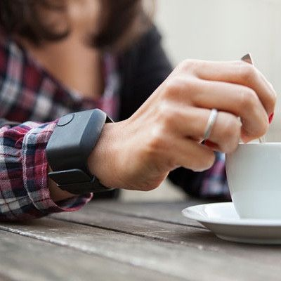

```{r, echo=FALSE, include=FALSE}
library(kableExtra)
library(knitr)
library(tidyverse)
```



Stress has well-documented effects on human health. A wearable device that is able to detect stress could provide feedback to the wearer, in order for that person to take a break for relaxation and stress relief (or to rip off the wearable and toss it across the yard, wait, did I admit that?). One challenge in stress detection is discriminating between stress and other states with similar physiological signatures in terms of heart rate and other measures.  Amusement is one such state.  Schmidt et al (2018) provide a database that can be used to explore how wearable devices may be used to detect stress.

# Learning Objectives

- gain proficiency handling very large datasets
- learn about special issues in processing and cleaning of sensor data
- use high-dimensional data to predict a biomedical outcome

# Case Study Goals

- Determine whether sensor data are useful in discriminating between stress and amusement conditions
- If sensor data are useful in discriminating between stress and amusement, describe how (e.g., is higher blood pressure related to a greater likelihood of stress vs amusement)
- Determine which types of sensor data are most useful in discriminating between stress and amusement, alone or in combination
- Determine whether we can detect stress (vs amusement) only using the wrist-worn wearable
- Quantify the heterogeneity across individuals in the response to stress versus amusement


# Data

- Data for this case study are available on the UCI Machine Learning Repository site for the [Wearable Stress and Affect Detection data](https://archive.ics.uci.edu/ml/datasets/WESAD+%28Wearable+Stress+and+Affect+Detection%29).

# Assignments and Reports

- Report and reproducible code (Group assignment due 9/25): produce a 8 page (maximum) report using R markdown that clearly addresses the case study goals. This report should follow the format of a standard scientific report and should include sections for the introduction, methods, results, and discussion. The methods section should clearly identify the approach to model selection and evaluation, and the results section should clearly specify the final model selected, along with evidence the model provides a good fit to the data. Code should be fully reproducible. Code run time should be clearly specified at the head of the file.

- Peer review of reports (Individual assignment due 9/28): using the peer review rubric provided, provide constructive feedback on the other group's report you have been assigned

- Revised report and response to reviews (Group assignment due 10/5): groups may submit revised reports and must submit a point-by-point response to the review comments provided


# Resources


[Git and GitHub on the DCC](decks/gitdcc.html)

[Physiology of Stress](https://samples.jblearning.com/0763740411/Ch%202_Seaward_Managing%20Stress_5e.pdf)

[Schmidt et al, Introducing WESAD, a Multimodal Dataset for Wearable Stress and Affect Detection](https://doi.org/10.1145/3242969.3242985)

[WESAD Data](https://archive.ics.uci.edu/ml/datasets/WESAD%20%28Wearable%20Stress%20and%20Affect%20Detection%29)

[Help Dealing with Data](https://github.com/brinnaebent/Examples_WESAD)

[Help Visualizing these Data](https://github.com/Big-Ideas-Lab/DBDP/tree/master/DigitalBiomarkers-ExploratoryDataAnalysis/MissingDataAnalysis)

[Using the Duke Computing Cluster](https://rc.duke.edu/dcc/dcc-user-guide/#toc_0 )

# Video Lectures (See Sakai)

[Predicting Stress from Wearable Sensors]

[Dealing with File Types]

[Alignment of Data]

[Data Considerations]

[Validation of Sensors]

[Common Pitfalls to Avoid]


