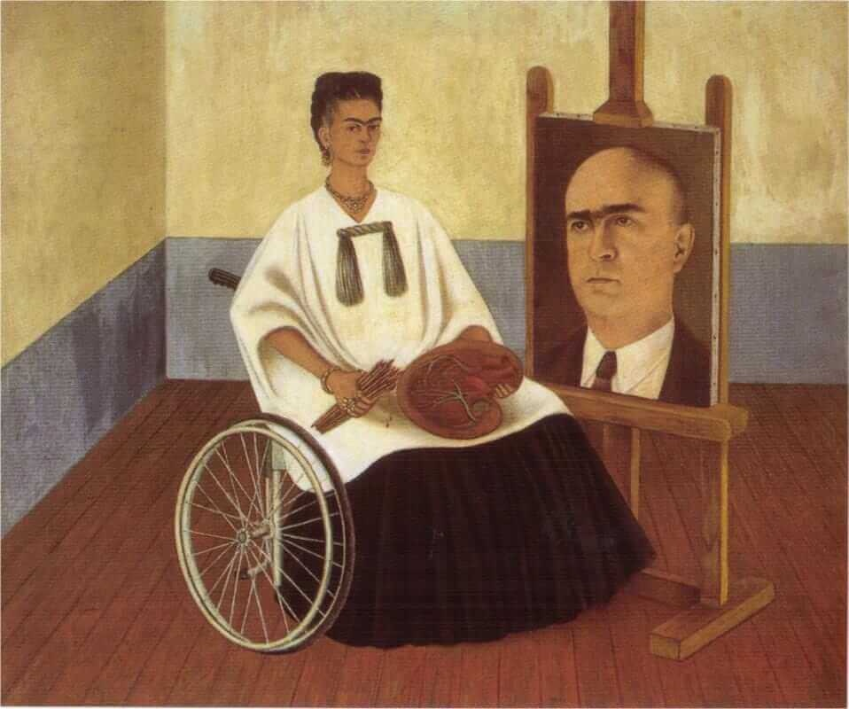

```{r, echo=FALSE, include=FALSE}
library(kableExtra)
library(knitr)
library(tidyverse)
```


# Learning Objectives

- get accustomed to the case study format and work pipeline
- translate applied question into hypothesis that can be formally tested by a statistical model
- practice skills writing models and communicating statistical results
- practice model evaluation 
- use reproducible research best practices

# Case Study Goals

The goal of the case study is to determine whether the data provided contain evidence of discrimination by the California Department of Developmental Services (DDS) against Hispanic residents.

Most US states provide services to support individuals with developmental disabilities (for example, cerebral palsy) and their families.  The DDS allocates funds to support over a quarter of a million residents who require assistance.  An allegation of discrimination was made and supported by univariate analysis examining annual expenditures by ethnicity; the annual expenditures on Latinx individuals was approximately 1/3 that of the average expenditure on white, non-Hispanic individuals.


# Data

The data include a random sample of 1000 DDS beneficiaries as well as their age, gender, annual expenditures, gender, and race/ethnicity. Details on these variables are provided below.

- Age: Age itself is provided as well as a binned variable for age cohort, the latter of which is basedon typical financial needs. The 0-5 years cohort typically has fewer needs and requires less funding, while services are often provided by schools (not the DDS) for children in the 6-12 years and 13-17 years cohort. Individuals in the 18-21 cohort are often in a phase of transition from their parents' homes to group homes or independent living. People in the age 22-50 cohort are typically not living at home but may receive financial support from their family, while people in the 51+ cohort have the most needs and often require the greatest amount of funding because their parents are often no longer living or no longer able to provide financial support.

- Gender: Reported by DDS as a binary variable with only male or female options.

- Expenditures: Annual expenditures by the DDS in supporting each individual and their family in providing care. This is the amount each individual receives from California and supports items such as psychological services, medical expenses, transportation, and housing.

- Ethnicity: Eight racial/ethnic groups are provided by DDS, representing the demographic profile of the state of California.

# Resources

- Interaction video on Sakai

- [Berkeley Discrimination Case](decks/berkeley.html)

# Tasks

1. Suppose these are the only relevant variables. What evidence in the data would lead you to believe that discrimination may be occurring?
2. Design an analysis plan to address the likelihood of discrimination
  - Outline meaningful exploratory data analysis to be conducted
  - Formulate a statistical model that allows you to evaluate whether discrimination seems likely
  - Formulate a plan for assessing model adequacy
  - Propose some graphical displays that would illustrate results of your analysis and help tell the story
  - Think about potential threats to validity of your analysis
3. Carry out your analysis plan and prepare 3 slides to tell your story:  1 describing your model (in formal mathematical notation) and 2 using graphics
4. Present results to your breakout group, including strengths and weaknesses of your investigation


